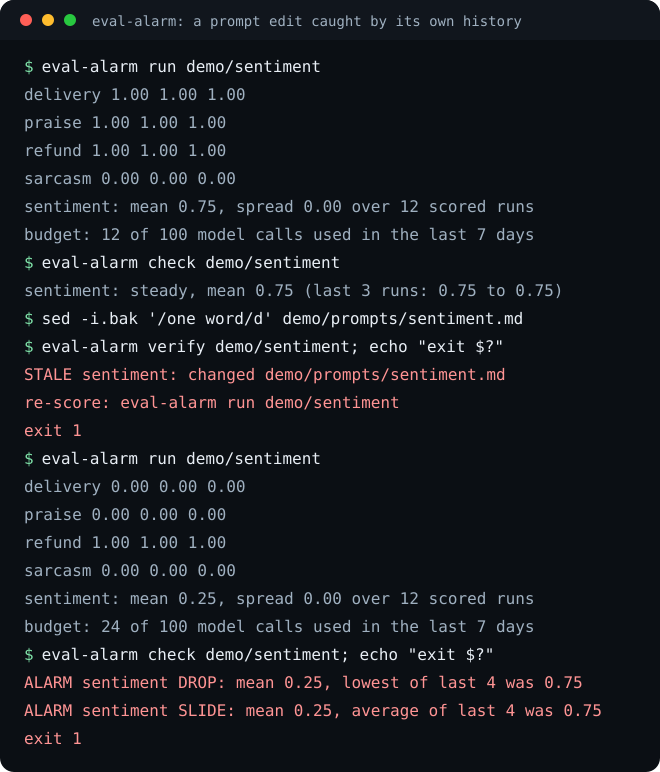

# eval-alarm

An edit to a prompt, a skill file or an agent's instructions can make the model's answers worse, and nothing fails until a person notices the output. eval-alarm sends a fixed set of cases through your model several times, scores every answer with a deterministic check, keeps the scores, and raises an alarm when the latest run falls below the suite's own recent history.




## Install

```bash
pipx install git+https://github.com/eliferres/eval-alarm
git clone https://github.com/eliferres/eval-alarm.git && cd eval-alarm
eval-alarm run demo/sentiment
eval-alarm check demo/sentiment
```

The clone is only for the demo suite; the demo needs no network and no model. Its model, `demo/fake_model.py`, labels reviews by keyword and obeys one instruction, which is enough to replay the session in the picture exactly. CI replays it on every push. It is not on PyPI. Without installing, `python3 -m eval_alarm` in the clone does the same (Python 3.9+, no dependencies).

For your own suite, the model is any command that reads a prompt on stdin and prints the answer, so `claude -p --model {model}`, `llm -m {model}` or a script of your own all work. `--dry` prints the plan and the budget arithmetic without calling anything:

```bash
eval-alarm run evals/<your-suite> --cmd 'llm -m {model}' --model <your-model> --dry
```

## What raises an alarm

| Rule | Command | What it catches | Why this test |
|---|---|---|---|
| `DROP` | `check` | The latest mean is below the lowest mean of the earlier runs in the window by more than `drop_margin` (0.05). | A step down past anything the suite has scored recently. With 20 cases, one case flipping from pass to fail is 0.05 and stays quiet; two flips alarm. |
| `SLIDE` | `check` | The latest mean is below the average of the earlier runs by more than `slide_margin` (0.10). | A decline spread over several edits never breaks the floor in one step. The average catches it. |
| `WIDER` | `check` | The latest spread (how far repeat reads of the same case disagree) is above the widest earlier spread by more than `spread_margin` (0.10). | A prompt can keep its mean while its answers get less consistent; that shows up as spread first. |
| `INCOMPLETE` | `check` | One or more calls in the latest run failed (non-zero exit, timeout, missing command). | The mean of the calls that happened to succeed says nothing about the ones that did not, so the run is not compared and fails the check instead. |
| `STALE` | `verify` | A file the suite covers changed, appeared or disappeared since the suite's last scored run, or the suite was never scored. | Lets CI refuse a prompt edit that nobody re-scored. |

Until a suite has `min_baseline` (3) earlier scored runs, `check` reports `baseline building` and never alarms. Only runs that scored every call form a baseline or count as scored for `verify`.

## Writing a suite

A suite is a folder. The layout borrows from OpenAI's evals registry (fixed samples with an ideal answer, judged by a named matcher) and the assertion types of promptfoo (`equals`, `contains`, `regex`, `is-json`), kept to checks that need no model to grade:

```text
evals/sentiment/
  suite.json                  optional settings
  cases/praise/prompt.md      the text sent to the model
  cases/praise/expected.json  {"scorer": "exact", "expected": "positive"}
  results.jsonl               appended by every run; commit it
```

Each case's `expected.json` names one scorer. A score runs from 0 to 1, and partial credit is deliberate: when one check of four breaks, the mean moves by a quarter, so a slide is visible before a collapse.

| Scorer | Settings | Score |
|---|---|---|
| `exact` | `expected`: a string or a list of accepted strings; `ignore_case` | 1 when the trimmed answer equals one of them, else 0 |
| `contains` | `expected`: a non-empty string or a list of them; `ignore_case` | the share of strings found in the answer |
| `regex` | `patterns` that must be found, `must_not` that must not; `ignore_case`. `^` and `$` anchor the whole trimmed answer; start a pattern with `(?m)` to anchor per line. A pattern that matches any answer, an empty one included (such as `.*`), is refused because it tests nothing; one that matches only a blank answer, such as `^\s*$` under `must_not`, is fine | the share of those checks that pass |
| `json` | `shape`: key to type (`string`, `number`, `integer`, `boolean`, `array`, `object`, `null`); `fields`: key to exact value, compared strictly (`true` is not `1`) | 0 when the answer is not JSON (one fenced block is unwrapped), else the share of checks that pass |

`suite.json`, every key optional:

```json
{
  "prompt": "../../prompts/sentiment.md",
  "covers": ["../../prompts/sentiment.md", "../../skills/tone/"],
  "command": "claude -p --model {model}",
  "model": "<model name>",
  "runs": 3,
  "timeout": 300,
  "alarm": {"window": 5, "min_baseline": 3, "drop_margin": 0.05,
            "slide_margin": 0.10, "spread_margin": 0.10}
}
```

- `prompt` is a template; each case's `prompt.md` replaces its `{{case}}` placeholder. Without a template the case text is sent as it is. A template with no placeholder is refused, because it would send every case the same text.
- `covers` lists the files and folders whose edits should force a re-score. It defaults to the template. The suite's own `cases/` folder and `suite.json` are always covered, since editing a case or a setting changes what the scores mean. Paths in `suite.json` resolve against the suite folder. Linked folders inside a covered folder are followed.
- `runs` is how many times each case is sent. It defaults to 3 so every run has a spread to compare.
- `window` is how many earlier scored runs form the baseline.
- The margins are fixed numbers, so they only make sense for a suite big enough that one answer weighs less than the margin. One wrong answer moves the mean by 1 / (cases x runs) and the spread by up to 1 / cases. The defaults need at least 10 cases at 3 runs each (30 answers: 0.033 per answer on the mean, 0.10 per case on the spread). A smaller suite gets a warning on stderr every time it loads, naming each margin it is too small for; raise those margins, as the four-case demo suite does, or add cases.

## Usage

```text
eval-alarm run SUITE... [--cmd CMD] [--model NAME] [--runs N] [--budget N] [--dry]
eval-alarm check SUITE... [--json]
eval-alarm verify SUITE... [--json]
eval-alarm --version
```

`run` prints each case's scores as they finish, then the suite's mean and spread. `--cmd`, `--model` and `--runs` override `suite.json`. The command runs in the directory you start eval-alarm from, with the prompt on stdin.

`--budget` caps model calls per rolling seven days (default: `EVAL_ALARM_BUDGET`, else 100). The whole planned run, every suite named, is checked before the first call; a plan that does not fit is refused whole. 100 is three full runs of a ten-case suite at three reads each with room to spare; set it to what your usage plan can carry.

| Exit | Meaning |
|---|---|
| 0 | Clean: the run scored every call, no alarm, every covered file current |
| 1 | Findings: an alarm, an incomplete run, a stale or never-scored suite, a failed model call, or a run refused by the budget |
| 2 | Usage or configuration error, one line on stderr |
| 130, 143 | Interrupted with Ctrl-C (130) or stopped with SIGTERM (143); the model call in flight is killed and the run is not recorded, though its reserved calls still count against the budget |

In CI, `verify` on every suite stops a prompt edit that arrived without a fresh run, and `check` stops one whose fresh run scored worse:

```bash
eval-alarm verify evals/*/ && eval-alarm check evals/*/
```

| Environment | Default | Holds |
|---|---|---|
| `EVAL_ALARM_BUDGET` | 100 | model calls allowed per rolling seven days |
| `EVAL_ALARM_STATE_DIR` | `$XDG_STATE_HOME/eval-alarm`, else `~/.local/state/eval-alarm` | `budget.jsonl` and `answers/<suite>-<path hash>/<time>/<case>-r<n>.txt`, every answer kept so a low score can be read instead of re-run |

## How it works

**The baseline is the suite's own history, not a fixed pass mark.** A fixed threshold is wrong in both directions. Set it at 0.8 and a suite that has scored 0.97 for months can lose a sixth of its quality without a sound, while a deliberately hard suite that sits at 0.6 fails every run until someone lowers the bar to silence it. Comparing against the last few runs holds each suite to its own record, and the window lets that record move when the suite or the model really changes.

**Several reads per case.** Models answer the same prompt differently from one run to the next. Three reads give each case a spread, and `WIDER` turns rising inconsistency into a signal of its own. Whether one unlucky answer can raise an alarm depends on the suite's size against its margins, which is why a suite too small for them is warned about when it loads.

**The budget is reserved before anything starts.** Every planned call is written to the budget ledger under an exclusive file lock before the first call, so two runs started at the same moment cannot both read "room left" and together spend past the cap. A call that fails or times out still counts; the cap errs toward spending less.

**An outage is neither a regression nor a pass.** A failed call (non-zero exit, timeout, missing command) is recorded with its reason and left out of the mean and spread, so a rate-limit afternoon does not register as a worse prompt. It does not register as a healthy one either: a run with any failed call is reported `INCOMPLETE`, exits 1, never joins a baseline, and never vouches for the covered files in `verify`. Re-run it.

**The fingerprint is taken before the calls.** Each record stores a sha256 of every covered file as it was when the run began, so `verify` compares against the version that was actually scored and names each file that changed since.

**Results live beside the suite.** `results.jsonl` sits in the suite folder so the history can be committed and CI judges a change against the same runs you saw. Writes take the same file lock; a torn or hand-edited line is skipped and reported, never fatal.

The sibling project [agent-eval-harness](https://github.com/eliferres/agent-eval-harness) compares two attempts at one task, judged blind. eval-alarm watches one prompt across many edits.

## Limitations

- POSIX only. The ledgers are locked with `fcntl`, which Windows does not have.
- Deterministic scorers only. Anything that needs judgment (tone, helpfulness) needs a model grader, which this tool does not include.
- The history assumes one setup. Changing the model, the command or the cases changes what the scores mean, and the baseline does not reset by itself; start a fresh `results.jsonl` when you change them on purpose.
- The model command runs in your working directory. An agent with file tools can open `expected.json` there; run it with its tools off.
- `verify` reads files on disk, not the git index, so in a pre-commit hook it sees unstaged edits too.
- The budget counts calls, not tokens or money, and its ledger is per machine: each CI runner starts with an empty one.

Contributions are welcome under [CONTRIBUTING.md](CONTRIBUTING.md); MIT licensed, see [LICENSE](LICENSE).
